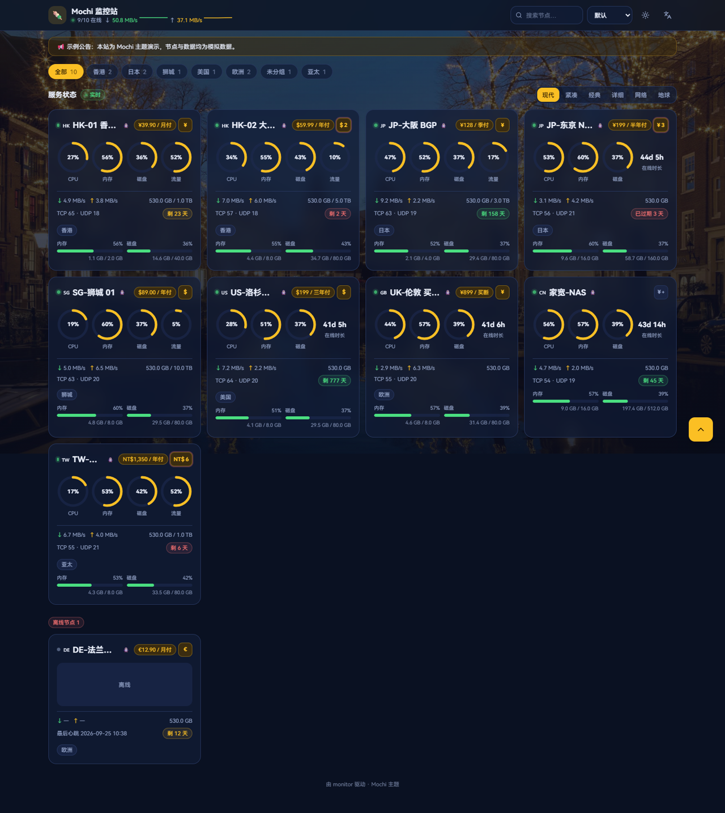

# Mochi — monitor 主题

为 [monitor](https://github.com/monitor-probe/monitor)（Rust 服务器探针）编写的公开状态页主题，观感与功能还原 [komari-web-mochi](https://github.com/svnmoe/komari-web-mochi)（React + Tailwind 的粉系 Mochi 风），并内置**剩余价值模块**（计算逻辑参照 komari-monitor/vps_price_calculator 与 realnovicedev/vps_calculator_docker）。



## 功能

- **六种视图**：现代（圆环卡片）/ 紧凑 / 经典列表 / 详细表格 / 网络（每节点 ping 小多图 + 丢包徽章）/ 地球（globe.gl 3D 地球按国家聚合标点，懒加载；**有节点的国家边框发光高亮**，颜色与在线状态一致，点国家边框同样可过滤）
- **节点详情页** `/instance/{id}`：系统信息、配置、网络三卡；CPU/内存/磁盘/网速历史图表（1h/6h/24h/7d）；网络质量多目标 ping 图与丢包率
- **剩余价值模块**：
  - 每个节点卡片上的货币小按钮 → 悬浮窗展示：到期倒计时、剩余价值（日均成本 × 剩余天数）、剩余比例、日均/月均/年均成本、每核/每 GB 内存/每 GB 磁盘·月成本、本期流量
  - 价格数据优先读后台（节点编辑里的 价格/币种/计费周期/到期时间）；后台未设置时访客可在悬浮窗**本地补录**（存 localStorage，不上传）
  - 浮动菜单 → **剩余价值总览**：全部节点按临期排序、按货币小计、手动汇率折算基准货币
  - 后台可用 `show_value_module` 配置整体关闭
- **视觉**：运河夜景照片背景（打包内置 `dist/assets/bg.jpg`，深蓝夜幕 + 琥珀金色调，暗色透出夜景、亮色为暖奶油纱罩）+ 半透明毛玻璃卡片；强调色五选一，图表折线、CPU 曲线与 3D 地球大气层跟随强调色
- **真实系统 Logo**：节点名旁显示发行版官方图标（内置 24 个：Debian/Ubuntu/CentOS/Rocky/AlmaLinux/Alpine/Arch/Fedora/RHEL/FreeBSD/openSUSE/Kali/Gentoo/NixOS/OpenWrt/Deepin/Oracle/Proxmox/树莓派/Docker/Windows/macOS 等，全部本地打包不依赖外网），按节点 `os` 字段自动匹配，未知系统回退 emoji，暗色下自动提亮
- **站点 Logo**：顶栏站名旁显示主题内置 Logo；后台升级后可在「主题设置 → 网站图标（ICON）」填图片地址，顶栏与浏览器标签页图标会一并替换
- **状态处理**：离线节点单独折叠在底部、metrics 缺失显示"不可用"、已过期红色徽章、未设置到期显示"长期"
- **其余**：分组 tabs（跟随节点顺序、汇总数字随分组）、搜索、七种排序、亮/暗色、中英双语、移动端适配、公告栏、PWA manifest

## 安装

```bash
# 构建并打包（产物 release/mochi-theme.tar.gz）
npm install
npm run pack:theme
```

monitor 后台 → 主题 → 上传 `mochi-theme.tar.gz` 并启用。包内 `theme.json` 平铺在压缩包根目录（hub 以 `short` 字段命名安装目录）；也可手动把 `mochi/` 目录（`theme.json + preview.png + dist/`）放到 hub 的 `--themes` 数据目录（默认 `/opt/monitor/data/themes/`）后重启。

## 主题设置（后台可调）

| 配置项 | 类型 | 默认 | 说明 |
|---|---|---|---|
| `default_view` | select | modern | 默认视图（六选一） |
| `theme_mode` | select | system | 默认配色（跟随系统/亮/暗，访客手动切换后以本地为准） |
| `accent` | select | gold | 强调色（琥珀金/海蓝/堇紫/松绿/樱粉），图表与地球同步变色 |
| `default_lang` | select | zh-CN | 默认语言 |
| `show_value_module` | boolean | true | 显示剩余价值模块 |
| `default_currency` | text | CNY | 节点未设置货币时的兜底 |
| `icon_url` | text | — | 网站图标（ICON）图片地址，填 https://…/logo.png 等，留空用默认 |
| `notice` | text | — | 顶部公告，留空不显示 |
| `footer_text` | text | — | 页脚文本，留空显示默认页脚 |

设置经 `GET/PUT /api/themes/mochi/config` 读写（只存改过的键，与 `theme.json` 默认值合并）。

> **注意**：设置弹窗需要较新的 hub 版本（旧版 hub 会忽略主题的 `config` 声明，卡片上不会出现「主题设置」滑杆按钮）。Docker 部署升级：`docker compose pull && docker compose up -d`（或 `docker pull ghcr.io/monitor-probe/monitor:latest` 后重建容器），主题与数据在挂载卷中不受影响。

## 剩余价值折算口径

```
日均成本   = 价格 ÷ 周期天数（monthly 30 / quarterly 91 / semiannual 182 / yearly 365 / biennial 730 / triennial 1095）
剩余天数   = hub 的 expires_in（key 存在即用；null=未设置）；本地补录的到期时间按浏览器时钟补算
剩余价值   = 日均成本 × max(剩余天数, 0)
剩余比例   = 补录了购买日时按 (到期-今天)/(到期-购买) 精确折算，否则 剩余天数 ÷ 周期天数
买断 once  = 到期前剩余价值=全价，到期归零
成本分摊   = 月均成本 ÷ 核心数 / 内存 GB / 磁盘 GB
```

## 开发

```bash
npm run dev        # 开发服务器 :5180，/api 代理到 MONITOR_HUB（默认 http://127.0.0.1:9911）
npm run mock       # 无真机时起一个契约一致的 mock hub（:9911，需先 build 提供 dist/）
npm test           # Vitest：剩余价值折算 / 格式化 单测
npm run shots      # mock hub + Playwright(系统 Edge/Chrome) 截图到 shots/
npm run pack:theme # 构建 + 打包 release/mochi-theme.tar.gz 并校验包结构
```

路由：`/` 状态页、`/instance/{id}` 节点详情（依赖 hub 对未知路径回退 `index.html` 的 SPA fallback）。

数据契约（`src/lib/types.ts`）：`/api/me`、`/api/nodes`、`/api/nodes/{id}/metrics?hours=&points=&series=metrics|ping`、`/api/ws`（2s 快照，断开 5s 轮询兜底）、`/api/themes/mochi/config`。字段以 hub `src/api.rs` 为准；匿名访问字段裁剪（无 ip/hostname/remark）均已容错。

地球视图贴图取自 `three-globe` 包内示例图（构建时复制进 `public/assets/`），无外链；globe.gl 为懒加载 chunk，不影响首屏。

## License

MIT
